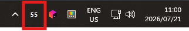
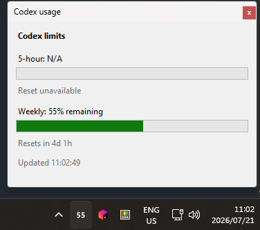

# Codex Usage Tray



A small Windows tray utility that displays the percentage of your Codex weekly allowance remaining.

The tray shows only the number. For example, `56` means **56% of the 7-day allowance remains**. Left-click the number for detailed 5-hour and weekly usage, reset countdowns, refresh status, and errors.

## Features

- One readable, background-free tray number: green while `Left` is non-negative, red when it is negative, and gray when unavailable.
- Detailed popup with 5-hour and weekly progress bars.
- Automatic refresh every minute and manual refresh from the tray menu.
- Warning notification once per reset cycle when either allowance reaches 20% remaining.
- Optional per-user **Start with Windows** registration.
- No API key, access token, or ChatGPT password stored by this application.
- No third-party application dependencies or NuGet packages.



## Requirements

- Windows 10 or Windows 11, x64.
- [.NET 10 Desktop Runtime](https://dotnet.microsoft.com/download/dotnet/10.0) to run the compiled application.
- [.NET 10 SDK](https://dotnet.microsoft.com/download/dotnet/10.0) to compile it yourself.
- The OpenAI Codex CLI installed and available as `codex` on `PATH`.
- Codex CLI signed in with ChatGPT on the same Windows account that runs this utility.
- Internet access for Codex to read current account limits.

## Install and sign in to Codex

If `codex --version` already works and `codex login status` says you are signed in with ChatGPT, skip this section.

Install the Codex CLI with npm:

```powershell
npm install --global @openai/codex
codex --version
```

Sign in using the browser-based ChatGPT flow:

```powershell
codex login
codex login status
```

If PowerShell blocks the generated `codex.ps1` script because of its execution policy, use the Windows command shim instead:

```powershell
codex.cmd login
codex.cmd login status
```

Choose **Sign in with ChatGPT**. This is important: ChatGPT authentication provides subscription access and the corresponding Codex allowance windows. API-key authentication uses OpenAI Platform usage-based billing and may not provide the 5-hour or weekly subscription limits this utility displays. See the official [Codex authentication documentation](https://learn.chatgpt.com/docs/auth).

## How authentication works

Codex Usage Tray does not ask for, read, copy, or persist an OpenAI API key.

On each refresh, it:

1. Starts `codex app-server --stdio` as a hidden child process.
2. Initializes the local JSONL app-server protocol.
3. Requests `account/rateLimits/read`.
4. Reads the general `codex` rate-limit bucket.
5. Terminates the child process.

The Codex CLI loads and refreshes its own saved login. By default, Codex state is under `%USERPROFILE%\.codex`; if `CODEX_HOME` is set, Codex uses that directory instead. The tray utility never opens `auth.json` itself and never writes authentication data.

The app-server call only reads account-limit state. It does not send a model prompt or intentionally consume model usage.

`codex app-server` is currently an experimental Codex interface. A future Codex CLI update could change its protocol. If usage suddenly stops loading after a CLI update, see [Troubleshooting](#troubleshooting).

## Compile

Open PowerShell in the repository directory:

```powershell
cd C:\path\to\codex-usage
dotnet restore
dotnet build --configuration Release
```

The framework-dependent x64 build is written to:

```text
bin\Release\net10.0-windows\win-x64\
```

The executable is:

```text
bin\Release\net10.0-windows\win-x64\CodexUsageTray.exe
```

Keep these files together when copying the application:

- `CodexUsageTray.exe`
- `CodexUsageTray.dll`
- `CodexUsageTray.deps.json`
- `CodexUsageTray.runtimeconfig.json`

The `.pdb` file is useful for debugging but is not required to run the application.

## Run tests

The package-free self-test covers response parsing, window classification, percentage clamping, weekly pacing calculations, malformed responses, timeouts, alert persistence, startup registration, single-instance behavior, popup reuse, and one live Codex usage read:

```powershell
dotnet run --configuration Release --no-build -- --self-test
```

A passing run prints:

```text
Self-tests passed.
```

Because the final test is live, it requires Codex to be installed, signed in, and able to reach OpenAI.

Check formatting separately:

```powershell
dotnet format --verify-no-changes
```

## Install the tray application

There is no installer. Copy the complete Release output to a stable directory, then run the executable. For example:

```powershell
$installDirectory = "$env:LOCALAPPDATA\Programs\CodexUsageTray"
New-Item -ItemType Directory -Force -Path $installDirectory
Copy-Item ".\bin\Release\net10.0-windows\win-x64\*" $installDirectory -Force
Start-Process "$installDirectory\CodexUsageTray.exe"
```

Do not enable **Start with Windows** until the executable is in its final location. The startup entry records the current absolute executable path.

## Use

After launch, look in the Windows notification area on the primary taskbar. Windows may initially place a new icon in the overflow menu behind the `^` arrow.

- The large number is the weekly percentage remaining; `%` is intentionally omitted.
- Hover over it for the exact weekly tooltip.
- Left-click it to open the detailed popup.
- Right-click it for:
  - **Refresh** - fetch current limits immediately.
  - **Start with Windows** - toggle per-user automatic startup.
  - **Exit** - close the utility.

The popup shows both recognized windows:

- `300` minutes is treated as the 5-hour window.
- `10080` minutes is treated as the 7-day window.
- Remaining percentage is calculated as `100 - usedPercent` and clamped to `0..100`.
- **Per day used** is consumed percentage divided by elapsed fractional days.
- **Per day left** is remaining percentage divided by fractional days until reset.
- **End of day** is the target at the next whole-day boundary: `(whole days left / 7) × 100`. For example, with 5 days 11 hours until reset, the target in 11 hours is `71.4%`.
- **Left** is the current remaining percentage minus the end-of-day target. A negative value means usage is already past that target.

OpenAI may omit a window for a particular plan or at a particular time. When that happens, the popup displays `N/A`; the app never substitutes an old session value. The tray number represents only the weekly window and displays `--` when current weekly data is unavailable.

## Start with Windows

Right-click the tray number and select **Start with Windows**. The application writes a single per-user value named `CodexUsageTray` under:

```text
HKCU\Software\Microsoft\Windows\CurrentVersion\Run
```

No administrator rights are required. Clear the menu item before moving or deleting the executable. If the application was moved while startup was enabled, run it from the new location and toggle the setting off and on again.

## Local data

The utility stores only alert-deduplication timestamps in:

```text
%LOCALAPPDATA%\CodexUsageTray\alerts.json
```

This prevents the 20% warning from repeating every minute during the same reset cycle. It contains no credentials or usage history.

## Troubleshooting

### The tray shows `--`

1. Confirm the CLI is installed:

   ```powershell
   codex.cmd --version
   ```

2. Confirm ChatGPT authentication:

   ```powershell
   codex.cmd login status
   ```

3. If signed out, run:

   ```powershell
   codex.cmd login
   ```

4. Right-click the tray number and select **Refresh**.
5. Left-click the tray number to read the full error message.

### Codex is installed but cannot be found

Open a new terminal after installing Codex so the updated `PATH` is loaded. Verify that this works:

```powershell
where.exe codex
codex.cmd --version
```

The tray application launches Codex through `cmd.exe`, so a working `codex.cmd` on `PATH` is sufficient even when PowerShell blocks `codex.ps1`.

### The app says authentication is required

Sign in using ChatGPT rather than an OpenAI Platform API key:

```powershell
codex.cmd logout
codex.cmd login
codex.cmd login status
```

Then use **Refresh**. If `CODEX_HOME` is configured, make sure the tray application inherits the same environment variable and therefore sees the same Codex login.

### The weekly number is available but 5-hour is `N/A`

This is expected when OpenAI returns only the weekly window. The application cannot derive an accurate current 5-hour value from the weekly value and deliberately avoids stale local-session data.

### The icon is missing

- Check the notification overflow menu behind the taskbar `^` arrow.
- Use Windows taskbar settings to keep Codex Usage Tray visible.
- Notification-area icons appear on the primary taskbar; secondary monitors may not show them.
- Starting a second copy does nothing because the application enforces a single running instance.

### Usage stopped loading after a Codex update

Check that Codex still works and is authenticated:

```powershell
codex.cmd --version
codex.cmd login status
```

Update the CLI if necessary:

```powershell
npm install --global @openai/codex@latest
```

If Codex works but this utility reports an unsupported response, the experimental app-server protocol may have changed and the reader will need updating.

## Uninstall

1. Right-click the tray number and clear **Start with Windows**.
2. Select **Exit**.
3. Delete the directory where you copied the Release output.
4. Optionally delete `%LOCALAPPDATA%\CodexUsageTray` to remove alert state.

The application does not install services, drivers, scheduled tasks, or machine-wide registry values.

## Project structure

- `CodexRateLimitReader.cs` - starts Codex, speaks the JSONL app-server protocol, and normalizes rate-limit windows.
- `TrayApplicationContext.cs` - tray lifecycle, refresh scheduling, menu, alerts, and startup behavior.
- `TrayIconRenderer.cs` - renders the transparent weekly number icon.
- `UsagePopup.cs` - detailed 5-hour and weekly popup.
- `AlertStateStore.cs` - persists once-per-cycle alert state.
- `StartupRegistration.cs` - manages the per-user Windows startup value.
- `SelfTests.cs` - package-free deterministic tests and live smoke test.

## Known limitations

- Windows x64 only.
- Requires the Codex CLI and its experimental app-server protocol.
- Shows only the general Codex bucket; model-specific buckets and purchased credits are intentionally ignored.
- No installer or automatic updater.
- The tray itself displays only weekly remaining usage; detailed 5-hour data remains in the popup.
